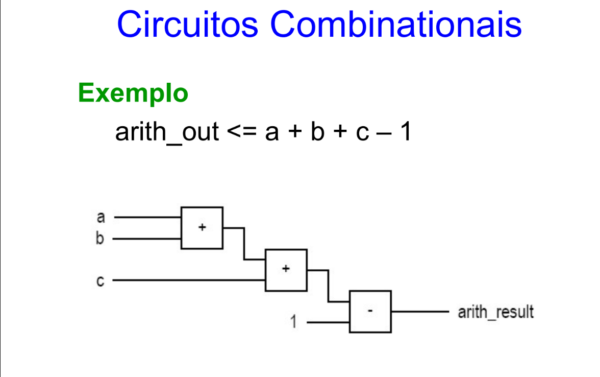

# lógica combinacional

# Circuitos Combinacionais
- Não há estado interno, não existem memórias;
- Saídas só são calculadas com base nas entradas;

# Exemplo:


---

> Sempre evitar de usar variáveis, pois ela não é 1:1 para o hardware. VHDL gera hardware;


# Sinal de Assinalamento:
Em uma linguagem de programação comum, geralmente o uso do símbolo de '=' serve para atribuir valores.
Já no VHDL, devemos usar <= para atribuir para um sinal

> x <= a and b; 
> (estamos dizendo que x, é uma and do sinal a e b)

# Comentários:
```
'---' é equivalente ao /**/ ou // em VHDL.
```

# Sinais Internos:
signal nome_variavel,.... : tipo_de_dado
variables nome_variavel,.... : tipo_de_dado

# Atribuição:
signal_name <= valor 
variable_name := valor
> Sempre preferir declarar no corpo.


# Tipo de Sinais Predominantes:
- std_logic: Um bit apenas;
- std_logic_vector: Um vetor de bits (bitstream);

# Uso de For:
Usar o for para conectar cada bit dos sinais criados, para uma porta lógica.
É mais fácil do que conectar um por vez na porta lógica

# Tipos de dados para variáveis:
- boolean
- integer
- real (sintetizável pra simulação, não vai ser usado)
- time (sintetizável pra simulação, não vai ser usado)

# Tipos de Dados:
- std_logic_1164:
    - **U:** não inicializado
    - **X:** indefinida
    - **0:**
    - **1:**
    - **'-':** don't care
    - **'Z':** alta impiedância (desligado)
    - **'W':** Indefinida fraco
    - **'L':** 0 fraco
    - **'H':** 1 fraco

# Tipo baseado em array:
- É usado para descrever memória;
- Sempre ao admitir valores literais, usar aspas duplas. Se é um único bit, não tem problema.
  